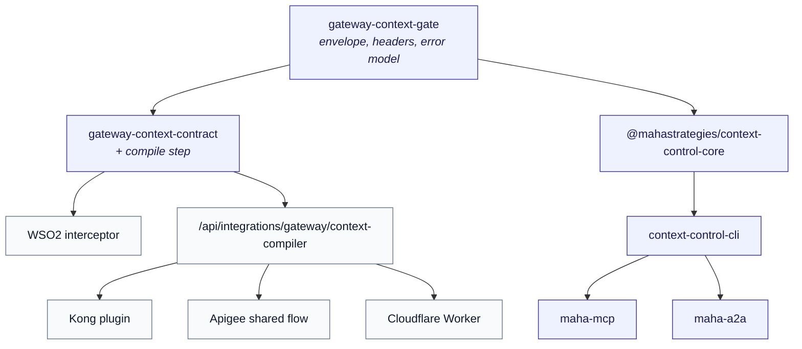

# Evaluate Maha context control locally

For an architect or developer who wants to judge this without a call, a vendor
account, or a credential. Everything below runs on a laptop and makes **no
provider call**.

## Ten minutes with the CLI

```bash
git clone https://github.com/Maha-Strategies/maha-corp-web && cd maha-corp-web
npm install
npm run verify:developer-surfaces
```

That builds all four packages, runs the contract tests, packs each package,
inspects what would ship, smoke-tests the CLI, and validates the gateway
artifacts. It needs no configuration and exits non-zero on any problem.

Then drive the CLI directly:

```bash
# 1. What is configured, and is it safe? Exits non-zero when it is not.
node --experimental-strip-types lib/context-control-cli/cli.ts doctor

# 2. Configure a local endpoint and check again.
export MAHA_CONTEXT_INTERCEPTOR_SECRET="$(head -c 32 /dev/urandom | base64)"
export MAHA_COMPILER_URL=http://localhost:3000/api/integrations/gateway/context-compiler
node --experimental-strip-types lib/context-control-cli/cli.ts doctor

# 3. Compile a sanitized fixture (needs `npm run dev` in another shell).
node --experimental-strip-types lib/context-control-cli/cli.ts \
  compile --input your-sanitized-request.json --output evidence.json

# 4. Verify the evidence structurally.
node --experimental-strip-types lib/context-control-cli/cli.ts verify --input evidence.json

# 5. Statically validate each gateway adapter. Deploys nothing.
for g in wso2 kong apigee cloudflare; do
  node --experimental-strip-types lib/context-control-cli/cli.ts gateway validate "$g"
done
```

`doctor` reports a secret by presence and length, never by value. `compile`
writes evidence, not the compiled prompt — putting source text in a file you
might commit is a worse outcome than an incomplete artifact.

## MCP

```jsonc
{
  "mcpServers": {
    "maha-context-control": {
      "command": "node",
      "args": ["./node_modules/@mahastrategies/maha-mcp/dist/maha-mcp/index.js"],
      "env": { "MAHA_COMPILER_URL": "http://localhost:3000/api/integrations/gateway/context-compiler" }
    }
  }
}
```

Five tools: `describe`, `validate_request`, `compile_sanitized`,
`verify_evidence`, `gateway_status`. Four are read-only. No tool accepts a
credential — `compile_sanitized` reads the secret from the environment, so a
model driving the surface cannot supply, learn, or exfiltrate one.

Nothing that deploys, pays, registers, or reaches a provider exists in the
module. That is a property of the code, not of a configuration flag.

## A2A

```ts
import { a2aAgentCard, handleA2ATask } from '@mahastrategies/maha-a2a'

handleA2ATask({
  taskId: 'stable-id-you-choose',
  policy: { tokenBudget: 800 },
  request: { messages: [/* ... */], maha_context: { /* ... */ } },
})
```

One capability, `maha.context-control.evaluate`. A task with no declared
`tokenBudget` is **rejected** rather than defaulted. Replay, approval and
failure are explicit fields. The card declares `payments`,
`externalTaskCreation` and `documentRetention` as `false` rather than omitting
them.

## Relationship to the gateway adapters



One decision, reached two ways: gateways enforce it in the request path,
packages let you inspect it. The compiler sits behind the contract and is
deliberately **not** in any published package.

## Security model

- **Fail closed everywhere.** Missing configuration, wrong credential,
  oversized payload, unavailable compiler, timeout, unusable compiler output —
  every one refuses. No adapter or package has a pass-through-on-error path.
- **Check order:** configuration → credential → payload size → JSON →
  idempotence → opt-in → media type → shape. A caller cannot learn whether a
  secret is right by sending a large body.
- **Idempotence.** `x-maha-compiled: true` suppresses a second compile.
- **Credentials never travel as data.** Not a tool argument, not an A2A task
  field, not a CLI flag, not a config file. Environment and secret stores only.
- **No source text in evidence.** Headers carry hashes, counts and a policy
  version. The full statement is the
  [security and data-boundary one-pager](/security/context-control-security-boundary.pdf).

## Compatibility matrix

| Surface | Status |
| --- | --- |
| `context-control-core` | **Implemented and tested locally.** Unit and contract tests; tarball contents asserted. |
| `context-control-cli` | **Implemented and runtime-tested locally.** All four commands executed against sanitized fixtures in `verify:developer-surfaces`. |
| `maha-mcp` | **Implemented and tested locally.** Tools dispatched in-process; schemas validated. **Not yet tested against a third-party MCP client.** |
| `maha-a2a` | **Implemented and tested locally.** Card and handler unit-tested. **Not yet tested against a third-party A2A client.** |
| WSO2 adapter | **Vendor-tested** at AI Gateway 1.1.0 (bounded evaluation). |
| Kong adapter | **Deployable, vendor deployment not validated.** |
| Apigee adapter | **Deployable, vendor deployment not validated.** |
| Cloudflare adapter | **Deployable, vendor deployment not validated.** |

## Demonstrable versus not yet proven

**Demonstrable today.** Deterministic selection and stable hashes. Hard budget
enforcement. Fail-closed behaviour on every named failure. Idempotence. That no
credential or source text reaches a header, a log, or a published tarball. That
the four gateway artifacts are internally consistent.

**Not yet proven.** That any adapter works against a live Kong node, Apigee
organization or deployed Worker. That the MCP or A2A surfaces interoperate with
a third-party client. Any particular saving or retention rate on your
documents — on Maha's own frozen benchmark a dense retriever scores higher on
evidence retention than the production scorer, and both results are published.
Production reliability, throughput, or behaviour at concurrency.

## Deployment boundaries

| Mode | What you run | What Maha runs | Where evidence lives |
| --- | --- | --- | --- |
| **Local evaluation** | Everything: compiler, gateway, CLI | Nothing | Your machine |
| **Self-hosted** | The compiler endpoint and your gateway | Nothing | Your infrastructure |
| **Hosted control plane** | Your gateway | The compiler endpoint | Metadata to your gateway; source text is not retained by the endpoint |

The packages are identical in all three. What changes is who operates the
endpoint — and in the third, your gateway, provider and logs still retain
whatever their own settings retain.

## Packages

Publish-ready at `0.1.0` and **not published**. Build and inspect locally:

```bash
npm run build:context-control-core && npm run pack:context-control-core
```
