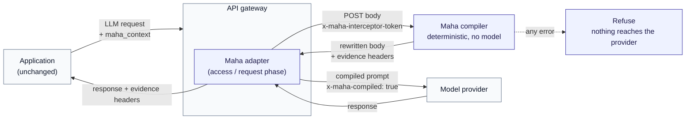

# Gateway middleware

Deploy the Maha Context Compiler in front of a model provider without changing
application code. The application keeps sending an ordinary OpenAI-compatible
request; the gateway compiles the context before it reaches the provider.

## Architecture



The compiler runs no model. Selection is deterministic ranking and
de-duplication over the documents the caller supplied.

## Compatibility matrix

| | WSO2 AI Gateway | Kong | Apigee | Cloudflare Workers |
| --- | --- | --- | --- | --- |
| Mechanism | Interceptor Service v1 policy | Plugin, access phase | Shared flow + ServiceCallout | Worker proxy |
| Envelope | WSO2 base64 envelope | Neutral JSON | Neutral JSON | Neutral JSON |
| Credential header | `x-maha-wso2-interceptor-token` | `x-maha-interceptor-token` | `x-maha-interceptor-token` | `x-maha-interceptor-token` |
| Credential source | Environment | Environment (`secret_env`) | KVM (`private.maha.*`) | `wrangler secret` |
| Evidence units | Percent *(existing contract)* | Basis points | Basis points | Basis points |
| Fail-closed | Yes, both phases | Yes | Yes | Yes |
| Idempotence | Extension removed upstream | `x-maha-compiled` | `x-maha-compiled` | `x-maha-compiled` |
| Timeout control | Policy `timeoutMillis` | `timeout_ms` | `io.timeout.millis` | `AbortSignal.timeout` |
| Local verification | Contract tests + failure suite | Docker Compose | Bundle validation | `wrangler dev` |
| Tested against a real vendor gateway | **Yes**, AI Gateway 1.1.0 | **No** | **No** | **No** |

The last row is the one that matters for planning. See "Status" below.

## Status, stated exactly

**Implemented and tested locally.** The shared contract and all four adapters:
28 contract and artifact tests, plus WSO2's ten existing contract tests, all
passing. `npm run verify:gateway-adapters` runs them without credentials.

**Deployable but not yet tested against a real vendor gateway.** Kong, Apigee
and Cloudflare. The code is complete and the configs are valid, but none has
been run against a live Kong node, an Apigee organization, or a deployed
Worker. Treat them as reviewed starting points, not as proven deployments.

**Tested against a real vendor gateway.** WSO2 only, at AI Gateway 1.1.0, in
the bounded evaluation recorded in `wso2-context-interceptor.md`.

## Vendor-specific prerequisites

| Gateway | Prerequisite |
| --- | --- |
| WSO2 | Production promotion needs a non-logged secret reference, service identity, or mTLS. The Interceptor Service policy has no separate call-auth parameter, so the credential travels in a gateway-inserted header, and WSO2 documents that headers may be logged. This adapter cannot close that. |
| Kong | `lua-resty-http` available; `enable_buffering` permitted on the route. Custom plugins need `KONG_PLUGINS` and the plugin on the Lua package path. |
| Apigee | Two private KVM entries (`private.maha.compiler.url`, `private.maha.interceptor.secret`) populated before the flow is attached. JavaScript callout quota sufficient for two policies per request. |
| Cloudflare | `MAHA_CONTEXT_INTERCEPTOR_SECRET` set via `wrangler secret put`. A route must be uncommented deliberately; the committed config publishes none. Worker CPU limits apply to the compile round trip. |

## Environment variables

| Variable | Default | Applies to | Purpose |
| --- | --- | --- | --- |
| `MAHA_CONTEXT_INTERCEPTOR_SECRET` | — | all | Shared secret. Preferred name. Minimum 32 characters. |
| `WSO2_CONTEXT_INTERCEPTOR_SECRET` | — | WSO2 | Accepted for existing deployments. |
| `MAHA_GATEWAY_MAX_BODY_BYTES` | `512000` | all | Payload cap. Refused, never truncated. |
| `MAHA_GATEWAY_TIMEOUT_MS` | `3000` | adapters | Timeout when calling the compiler. |
| `MAHA_GATEWAY_MINIMUM_COMPILE_TOKENS` | `1024` | all | Below this, forward the original. |
| `MAHA_COMPILER_URL` | — | Cloudflare | Compiler endpoint. |
| `MAHA_PROVIDER_URL` | — | Cloudflare | Provider the rewritten request goes to. |

Secrets live in environment variables and secret stores only. No file in this
repository contains one, and a test asserts it.

## Verify

```bash
npm run verify:gateway-adapters
```

Contract tests, static artifact checks and configuration validation. No
credentials, no gateway, no provider call.

Per-gateway install guides: [WSO2](../../integrations/wso2/README.md) ·
[Kong](../../integrations/kong/README.md) ·
[Apigee](../../integrations/apigee/README.md) ·
[Cloudflare](../../integrations/cloudflare-workers/README.md) ·
[contract](../../integrations/gateway-contract/README.md).

## Limitations

- **Adapter-level support is not vendor endorsement.** Kong, Apigee, Cloudflare
  and WSO2 have not reviewed, certified or approved this work. These adapters
  target documented extension points; that is all.
- **Source-text retention.** Source text is processed in the request that
  carries it. The compiler returns the passages it selected, verbatim, to the
  caller who supplied them. The neutral compile endpoint writes nothing and
  marks its responses `no-store`. Your gateway, your provider and your own
  logging may retain the same text under settings Maha neither sets nor sees.
  The full statement is the
  [security and data-boundary one-pager](/security/context-control-security-boundary.pdf).
- **Token counts.** The compiler reports model-neutral estimates, not provider
  tokenizer counts. Provider token counts are measured at the provider boundary
  where the gateway exposes them, and the two will not match exactly.
- **No guaranteed rate.** No particular saving or retention rate is promised.
  What reduction you get depends on your documents, your budget and your task.
- **Timeouts and payload caps must be tuned per deployment.** The defaults are
  starting points chosen to be safe, not values measured against your gateway's
  own body-buffer limits or your compiler's network distance. Set them
  deliberately.
- **Three of four adapters are untested against their vendor.** See "Status".
