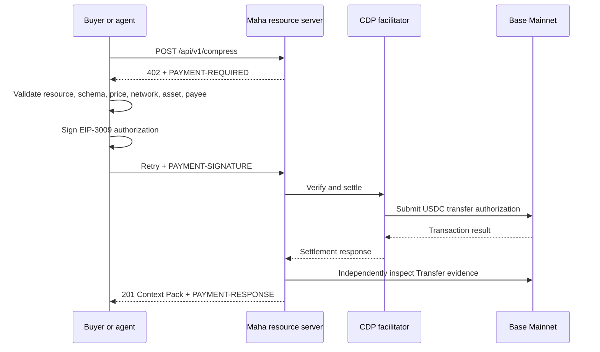

# Maha Strategies and x402

## Infrastructure, evidence, commercial position, and recommended direction

**Report date:** 9 August 2026  
**Repository baseline:** `main` at `c12075d`  
**Production resource:** [Maha Context Compiler](https://www.mahastrategies.com/api/v1/compress)  
**Scope:** Maha's x402 seller implementation, supporting buyer and conformance infrastructure, evidence of readiness, commercial economics, risks, and a prioritized roadmap.

> This report distinguishes deployed production behavior from public reference software, draft ecosystem proposals, and operator-reported milestones. It is a technical and commercial assessment, not legal, tax, banking, or investment advice.

## Executive assessment

Maha Strategies has moved beyond an x402 demonstration. It operates a production x402 v2 resource on Base Mainnet, has completed real USDC settlements, publishes a machine-readable Bazaar contract, and has built several pieces of reusable ecosystem infrastructure around the seller: a diagnostic CLI, conformance fixtures, a public observatory, a buyer-policy library, executable recipes, and a draft metadata-integrity proposal.

The strongest production asset is narrow and credible: the Context Compiler accepts long documents or RAG inputs and returns a token-budgeted, extractive Context Pack with source-linked passages, hashes, explicit retention boundaries, and no source-text retention. It costs **0.001 USDC per call**. A live production probe on the report date returned HTTP 402 with the x402 v2 `PAYMENT-REQUIRED` header, Base Mainnet network identifier `eip155:8453`, USDC amount `1000` base units, and a complete Bazaar input/output declaration.

The strongest independent product evidence is MCRB-1, a 250-case benchmark built from 136 QASPER papers. Under its fixed extractive budget, Maha BM25 retained the complete annotated evidence set in **60.4%** of cases, achieved **66.2% mean evidence recall**, reduced input by **74.4%** on average, preserved **100% citation traceability**, and ran at **5.89 ms local p95**. This substantially outperformed front truncation, tail/recency selection, seeded random selection, and Maha's keyword baseline. It did not approach the oracle ceiling, and it was not compared with generative summarizers because that requires a different answer-quality protocol.

The central commercial constraint is distribution, not payment plumbing. At $0.001 per call, one million calls produce only $1,000 of gross revenue before facilitator, chain, hosting, support, and compliance costs. Organic agent traffic could validate demand and become a useful low-friction acquisition channel, but it should not be the only revenue thesis. The better portfolio strategy is:

1. use the Context Compiler as a machine-purchasable wedge and proof of x402 competence;
2. turn usage into SDK, integration, and enterprise-gateway adoption;
3. monetize higher-value governance, policy, observability, private deployment, and support; and
4. contribute neutral tooling upstream so Maha becomes a credible infrastructure participant rather than only another listed endpoint.

## 1. What x402 is and why it matters to Maha

x402 is an open, Apache-2.0 payment standard built on HTTP `402 Payment Required`. A resource server returns payment terms, a client signs a payment payload, the server verifies and settles it directly or through a facilitator, and the server then returns the resource. The protocol is intended for programmatic, pay-per-use access without the account creation and subscription setup normally required by API billing. [The x402 documentation](https://docs.x402.org/introduction) identifies APIs, autonomous agents, content, microservices, and usage-based services as core use cases.

x402 v2 standardizes three Base64-encoded JSON headers:

- `PAYMENT-REQUIRED`: seller to buyer, containing the resource and accepted payment requirements;
- `PAYMENT-SIGNATURE`: buyer to seller, containing the signed payment payload; and
- `PAYMENT-RESPONSE`: seller to buyer, containing settlement results.

The official [HTTP 402 documentation](https://docs.x402.org/core-concepts/http-402) and [client/server flow](https://docs.x402.org/core-concepts/client-server) describe this six-step challenge, authorization, verification, settlement, and delivery sequence.

For Maha, the strategic value is not merely accepting stablecoins. x402 makes a capability:

- callable without creating an account;
- price-discoverable by software;
- purchasable under an agent's spending policy;
- settleable in the same API interaction; and
- eligible for discovery through catalogs such as CDP Bazaar.

That is a particularly good match for a fast, stateless preprocessing task. Context compression occurs before a more expensive model call, its value can be measured in avoided input tokens, and its low price can fit inside an autonomous agent's bounded budget.

## 2. Maha's production seller contract

### 2.1 Live commercial terms

| Field | Production value |
|---|---|
| Resource | `POST https://www.mahastrategies.com/api/v1/compress` |
| Service | Maha Context Compiler |
| Protocol | x402 v2 |
| Scheme | `exact` |
| Network | Base Mainnet, `eip155:8453` |
| Asset | Native USDC, `0x833589fCD6eDb6E08f4c7C32D4f71b54bdA02913` |
| Price | `1000` base units, or 0.001 USDC |
| Payee | `0xec84c1cd6602bbe387bc8e6f0d3c062f2762de28` |
| EIP-712 domain | `USD Coin`, version `2` |
| Payment timeout | 60 seconds |
| Response | JSON Context Pack with provenance and metrics |

The production configuration is fail-closed. x402 is inactive unless explicitly enabled, incomplete facilitator or asset configuration is rejected, the facilitator must use HTTPS, CDP credentials must appear as a pair, and a priced route must release its concurrency slot. The payment path is separate from the tenant API-key and Stripe credit path.

The public discovery description accurately positions the service as a token-budgeted, deduplicating context compiler rather than a general factual summarizer. The live contract also states important non-fit boundaries: selection is extractive and best-effort, evidence can be omitted under a fixed budget, token counts are model-neutral estimates, and the service does not verify claims or guarantee completeness.

### 2.2 Request and settlement flow

### 2.3 Security and reliability controls

The implementation includes controls that are often absent from first-generation x402 demos:

- exact binding to the requested resource, network, asset, payee, and amount;
- strict x402 v2 header parsing;
- EIP-712 domain data required for USDC authorization verification;
- facilitator verification and settlement;
- replay protection backed by an append-only settlement ledger;
- independent Base receipt and ERC-20 `Transfer` log confirmation;
- explicit `confirmed`, `contradicted`, and `indeterminate` chain outcomes;
- concurrency limits and expiring capacity slots;
- fail-closed handling when payment or capacity state cannot be trusted;
- CORS exposure of the three payment headers; and
- redaction of sensitive provider errors from public responses.

The key architectural decision is that a facilitator success response is not treated as the only evidence. Maha attempts to bind the reported transaction to an on-chain token transfer from payer to payee for the required amount. This reduces dependence on ambiguous provider messages and creates a stronger audit record.

### 2.4 Settlement evidence

Production settlement has been demonstrated, not simulated. Evidence supplied during implementation includes:

- [Base transaction `0x6f2d…b585`](https://basescan.org/tx/0x6f2dac3a9ee41edc514511cebda44b47910df5083658b972f0daa1f7c375b585), which returned HTTP 201 and a Context Pack; and
- [Base transaction `0x7621…74e8`](https://basescan.org/tx/0x7621b7c024baa8f60e4af8638a8e27cd23e0e7d88848baa3cbcac76dfbb074e8), produced by the executable Bazaar discovery-to-payment recipe.

The operator separately confirmed receipt of 0.001 USDC in the merchant wallet. These transactions prove technical settlement. They do **not** by themselves prove external demand because the demonstrated buyer wallet was operator-controlled.

## 3. Discovery and machine usability

### 3.1 CDP Bazaar

[CDP Bazaar](https://docs.cdp.coinbase.com/x402/bazaar) catalogs x402-enabled resources and exposes paginated discovery, semantic search, and an MCP interface. In v2, sellers provide the Bazaar extension with complete input/output JSON Schema and examples. The CDP facilitator catalogs that declaration after a successful settlement; verification alone is insufficient. Catalog updates are asynchronous and cached.

Maha's production challenge contains:

- a semantic service description and tags;
- a realistic multi-source request example;
- a complete input schema with required fields and constraints;
- a fully typed output schema;
- response examples containing metrics, passage IDs, source IDs, hashes, warning codes, and retention boundaries; and
- explicit non-fit and multilingual behavior.

This is materially better than a bare endpoint listing. It gives an agent enough information to decide whether the service fits a task before it signs a payment.

### 3.2 Executable discovery-to-payment recipe

The repository demonstrates the complete machine flow:

1. semantically search Bazaar;
2. inspect the JSON Schema;
3. enforce a $0.005 task ceiling;
4. validate the 0.001 USDC requirement;
5. sign with a Viem or CDP wallet;
6. verify `PAYMENT-RESPONSE` and on-chain evidence; and
7. use the returned Context Pack in the downstream prompt.

The live Viem execution completed successfully. The CDP path also correctly detected an unfunded wallet before signing, demonstrating that wallet identity and balance checks are part of the policy boundary rather than hidden facilitator failures.

### 3.3 Listing continuity and monitoring

The production canary checks the Bazaar record twice weekly and makes at most one bounded 0.001 USDC settlement when the last cataloged settlement is at least 21 days old. Real settlements reset the same clock. Canary traffic is explicitly operational traffic and must be excluded from customer revenue and external-demand claims.

The Context Compiler is also monitored by a paid x402 Trust endpoint watch with five-minute probes and Discord delivery. The webhook credential and watch secret are intentionally excluded from this report.

## 4. Product evidence: MCRB-1

### 4.1 Methodology

The [Maha Context Retention Benchmark](https://www.mahastrategies.com/benchmarks/context-retention) uses the QASPER dev split under CC BY 4.0. It selects 250 answerable questions across 136 papers by a deterministic question-ID hash order. Mean input length was 6,447.1 BPE tokens. Evidence appeared at the front in 95 cases, middle in 93, and back in 62, reducing the positional bias of a front-only workload.

Every evaluated method received a 2,048-token declared budget. The primary metric was complete annotated-evidence-set retention. Other metrics included any-evidence hit rate, mean evidence recall, output tokens, reduction, citation traceability, and local latency.

### 4.2 Results

| Method | Complete evidence set | Mean evidence recall | Mean reduction | Citation traceability | Local p95 |
|---|---:|---:|---:|---:|---:|
| **Maha BM25** | **60.4%** | **66.2%** | 74.4% | 100% | 5.89 ms |
| Maha keyword | 54.0% | 58.8% | 74.5% | 100% | 5.33 ms |
| Front truncation | 25.6% | 27.9% | 73.1% | 100% | 8.23 ms |
| Tail/recency | 20.4% | 22.7% | 73.2% | 100% | 7.92 ms |
| Seeded random | 21.6% | 26.9% | 73.3% | 100% | 8.16 ms |
| Oracle ceiling | 99.6% | 99.6% | 73.3% | 100% | 10.80 ms |

Maha BM25's complete-set score had a 95% Wilson interval of 54.2%–66.3%. Its advantage over front truncation was particularly important for middle and back evidence: front truncation retained a complete set in 0% of those cases, while Maha BM25 achieved 62.4% for middle evidence and 54.8% for back evidence.

The oracle is not a competitor. It ranks known gold evidence first and represents an unattainable upper bound. The gap between Maha's 60.4% and the oracle's 99.6% is therefore a useful statement of remaining retrieval headroom, not evidence that a commercial product called “Oracle Ceiling” is winning.

### 4.3 Economics

At a reference model input price of $3 per million tokens, MCRB-1 measured:

- 4,935.1 mean input tokens avoided per case;
- $0.014805 gross input cost avoided;
- $0.001 x402 fee; and
- $0.013805 net input cost avoided after the fee.

In this workload, gross avoided input cost was approximately **14.8 times the service fee**. That result is useful but bounded: it excludes downstream output cost equally for every method, assumes the reference input price, and does not prove that every real payload will retain the evidence a caller needs.

The public large-document recipe provides a second, workload-specific example: 22,340 BPE tokens were reduced to 5,733, a 74.34% reduction. At $3 per million input tokens, that avoided approximately $0.0498 gross, or $0.0488 net of the $0.001 call. It should be presented as an executable case study, not as the benchmark-wide average.

### 4.4 What the benchmark does not establish

MCRB-1 does not measure generated-answer accuracy, factuality, provider-specific billing tokens, every enterprise data type, or every language. It evaluates extractive selection on NLP research papers. It does not compare Maha with LLM-generated summaries or LangChain summarization middleware; those require a separate blinded answer-quality and citation protocol. Local algorithmic latency is not a network SLA.

## 5. Maha's x402 ecosystem contributions

Maha's defensible position is broader than one paid endpoint. The project has begun building neutral infrastructure that other buyers, sellers, SDKs, and facilitators can use.

### 5.1 x402 Doctor — public implementation

`x402-doctor` is a read-only-by-default CLI and GitHub Action that:

- requests and decodes a live challenge;
- validates v2 headers and CAIP-2 networks;
- validates Bazaar schemas and examples;
- reproduces the crawler request and detects accidental HTTP 400 responses;
- compares the live declaration with the indexed Bazaar record;
- inspects extension responses;
- optionally performs one bounded settlement; and
- emits human, JSON, and SARIF reports for CI.

Payment requires three explicit controls: `--pay`, a positive base-unit ceiling, and a dedicated private key. Read-only conformance errors prevent signing. The [implementation guide](../x402-doctor.md) and [upstream proposal](../x402-doctor-upstream-proposal.md) are in the repository. Maintainer acceptance and upstream placement remain external dependencies; local existence should not be described as upstream adoption.

### 5.2 Vendor-neutral conformance corpus — public implementation

The [x402 v2 conformance corpus](https://www.mahastrategies.com/conformance/x402-v2/corpus.json) provides deterministic fixtures for valid v2 challenges and EIP-3009 signatures, malformed networks, wrong chain/token/payee/amount, expiration, replay, crawler errors, invalid Bazaar declarations, stale metadata, ambiguous settlement timeouts, and missing or malformed receipts.

Fixtures express a portable verdict, phase, stable code, and retry safety. They require no funded wallet or chain connection. The corpus is Apache-2.0 and is suitable for adoption by SDKs, facilitators, resource servers, and CI systems. It does not replace chain-backed integration testing.

### 5.3 Open Conformance Observatory — public implementation

The [Open x402 Conformance Observatory](https://www.mahastrategies.com/x402-observatory) runs factual, point-in-time checks for reviewed, allowlisted public resources. It reports challenge reachability, v2 conformance, schema validity, crawler behavior, and Bazaar freshness. Paid checks are disabled by default and require explicit operator consent plus a bounded credential.

The observatory deliberately does not publish subjective trust, quality, reputation, or uptime scores. It complements rather than duplicates x402 Trust. Its append-only storage excludes bodies, credentials, IP addresses, and user agents.

### 5.4 Buyer-policy library — published package

[`@mahastrategies/x402-buyer-policy`](https://www.npmjs.com/package/@mahastrategies/x402-buyer-policy) is published at version 0.1.1. The zero-dependency TypeScript package enforces:

- maximum amount per call and task;
- approved network/asset pairs and payees;
- exact resource binding;
- schema-evidence requirements;
- scoped, expiring human approvals;
- authorization and settlement replay prevention; and
- receipt plus optional chain-evidence verification.

The package does not hold a wallet, choose a facilitator, validate arbitrary JSON Schema, or judge whether a service is useful. Its in-memory ledger is for examples and tests; distributed production agents need an atomic durable adapter. Viem, LangChain.js, and MCP boundaries are documented. Python/CrewAI guidance is contract-level only; there is not yet a native Python package.

### 5.5 Declaration-integrity digest — draft proposal

The [declaration-integrity proposal](../x402-declaration-digest-proposal.md) defines a canonical SHA-256 digest, seller metadata version, and canonical resource URL so a catalog can expose the exact declaration it indexed. This would let diagnostics distinguish a current record from stale metadata without heuristically comparing transformed fields.

This is a draft for ecosystem review, not an x402 standard, and Maha's production seller does not advertise it. Its value depends on catalog and maintainer adoption.

## 6. Commercial position

### 6.1 Where Maha is strong

Maha has a credible combination that is uncommon among small x402 sellers:

- a real, low-latency, stateless resource with measurable downstream savings;
- a settled production payment path rather than a testnet-only demo;
- strict, machine-readable schemas and realistic examples;
- a public benchmark with reproducible methodology and honest limitations;
- operational canaries, replay controls, chain confirmation, and monitoring; and
- buyer-side and ecosystem tooling that demonstrates protocol understanding.

The Context Compiler is best viewed as a wedge into context engineering and autonomous API commerce. It is easy to try, cheap enough for agent policies, and produces an output that can be inspected immediately.

### 6.2 Revenue arithmetic

Flat micropricing creates a simple but unforgiving volume model:

| Paid calls | Gross revenue at $0.001 |
|---:|---:|
| 1,000 | $1 |
| 10,000 | $10 |
| 100,000 | $100 |
| 1,000,000 | $1,000 |
| 10,000,000 | $10,000 |

These are gross figures before infrastructure, failed attempts, RPC/facilitator dependencies, support, compliance, and conversion to fiat. Therefore:

- organic Bazaar calls are useful validation and distribution;
- repeat calls from real external wallets are a stronger signal than impressions;
- the micro-endpoint alone requires very high volume to become meaningful revenue; and
- the near-term business should not depend on autonomous discovery suddenly producing millions of calls.

### 6.3 Recommended revenue ladder

1. **Free evaluation:** benchmark, playground, recipes, public schemas, and observatory.
2. **Autonomous micro-purchase:** 0.001 USDC Context Compiler call.
3. **Developer adoption:** TypeScript/Python SDKs, LangChain, CrewAI, MCP, and Viem integrations.
4. **Team usage:** API-key billing, usage reporting, support, higher limits, and stable fiat purchasing.
5. **Enterprise control plane:** governed MCP gateway, tenant isolation, tool allowlists, audit trails, circuit breakers, private upstreams, and contractual support.
6. **Private deployment or design partnership:** organization-specific context policies, data boundaries, and integration assistance.

The endpoint can acquire developers at machine speed; the gateway and control plane can produce contract-sized revenue.

## 7. Traction and measurement

The evidence in this report proves technical readiness, not product-market fit. The known production settlements cited above were generated during operator-controlled tests. No production database query was performed for this report, so it makes no claim about the current number of external payers.

The new acquisition meter creates the right measurement foundation without retaining source content. It distinguishes:

- anonymous HTTP 402 challenges;
- x402 settlement rows;
- distinct paid wallets;
- successful credential usage;
- repeat credential usage on a later day; and
- anonymous successful calls.

The challenge-to-settlement numerator is settlement count, not distinct wallet count. Distinct payers remain a separate stage. Payment refusals are excluded from the discovery denominator because they occur after payment presentation and are operational failures, not discovery events.

Early readings must subtract or label the dedicated canary payer. The canary converts by construction and would otherwise flatter conversion at low traffic. Discovery events also cannot be deterministically joined to later credentials without adding an identifier that the current privacy posture intentionally avoids; the funnel is cohort-level, not an individual customer journey.

### Minimum weekly scorecard

- external challenges, excluding internal probes where identifiable;
- total settlements and externally attributable settlements;
- distinct external payer wallets;
- challenge-to-settlement rate;
- seven- and thirty-day repeat payer rate;
- average tokens saved and source coverage per paid call;
- gross revenue and estimated variable cost per call;
- Bazaar semantic-search rank for target queries;
- playground-to-code-copy and playground-to-payment conversion;
- API keys created, activated, and repeated; and
- enterprise gateway conversations, pilots, and proposals.

## 8. Material risks

### Protocol and provider concentration

Maha depends on facilitator availability and correct error semantics. An ambiguous settle timeout cannot safely be retried without checking authorization and chain state. The conformance corpus and chain confirmation mitigate this but do not remove provider concentration.

### Discovery freshness

Bazaar indexing follows successful settlement and is asynchronous. A live seller can be correct while its catalog metadata is stale. Doctor, the drift workflow, bounded canary, and proposed declaration digest reduce the operational blind spot, but catalog behavior remains external.

### Low unit economics

The $0.001 fee is excellent for evaluation and routing but provides little margin at low volume. Pricing must eventually reflect payload size, saved cost, support level, or higher-value workflow outcomes without destroying the clean stateless purchase experience.

### Quality boundaries

Extractive compression can omit necessary evidence. Source coverage is not evidence recall, and a small payload can even grow after framing. The product must continue exposing retained passages, warning codes, and token metrics rather than claiming universal compression or factual safety.

### Metric contamination

Canaries, crawler probes, operator testing, and repeated calls from one wallet can resemble demand. External revenue reporting needs payer labeling or explicit exclusions.

### Wallet and policy safety

Agents need task budgets, resource binding, payee allowlists, replay protection, and approval thresholds. A wallet capable of signing is not a complete purchasing policy. The buyer-policy package is directionally correct but needs durable adapters and external review before it becomes a production security dependency for others.

### Legal and banking dependencies

Stablecoin acceptance, merchant treatment, custody, conversion, tax, sanctions/KYT, consumer protection, and local virtual-asset rules can change the permissible operating model. The operator has reported obtaining banking approval and consulting counsel, but those facts are not independently verified here and should not be treated as a legal conclusion. Written advice should cover unhosted-wallet payers, facilitator roles, merchant exemptions, recordkeeping, and fiat conversion.

## 9. Prioritized roadmap

### Next 30 days: prove external use

1. Operate the current endpoint without adding another speculative paid resource.
2. Read the acquisition funnel weekly and explicitly exclude canary traffic.
3. Confirm semantic discovery for real task phrases, not only the product name.
4. Publish complete LangChain, CrewAI, MCP, Viem, and CDP examples that terminate in a real Context Pack.
5. Convert the best benchmark result into one concise integration claim with its limitations attached.
6. Seek at least five external wallet settlements and two repeat external payers before changing price.

### 30–60 days: turn credibility into adoption

1. Obtain maintainer feedback on x402 Doctor's upstream scope.
2. Invite SDK and facilitator maintainers to run the conformance corpus and report mappings.
3. Add Redis or Postgres adapters to buyer policy, with atomic reservation and settlement claiming.
4. Produce the separate multilingual/code-block workload requested by developers.
5. Add a generated-answer benchmark only if it uses blinded evaluation, citation verification, and comparable model costs.
6. Use the Context Compiler integration to open gateway design-partner conversations.

### 60–90 days: establish a monetizable control plane

1. Package enterprise MCP governance around allowlists, audit logs, tenant policy, timeouts, circuit breakers, and private upstreams.
2. Offer a paid pilot with explicit success criteria rather than a generic platform subscription.
3. Provide fiat billing for human organizations while preserving x402 for autonomous calls.
4. Test value-based or size-aware pricing only after real payload distribution and repeat behavior are known.
5. Decide whether the observatory remains a public-good credibility asset or gains paid private history, CI retention, and notification features.

## 10. Decision gates

Further engineering should be tied to observable gates:

| Decision | Evidence required |
|---|---|
| Keep 0.001 USDC flat price | External settlements and positive buyer savings at actual payload sizes |
| Add a second x402 resource | Repeated demand for a specific capability, not general interest |
| Build native Python buyer policy | At least two Python/CrewAI adopters blocked by the TypeScript-only package |
| Add LLM summarization comparison | Reproducible answer-quality evaluation and budget for equivalent model calls |
| Commercialize observatory | Requests for private endpoints, retained history, CI, or alerts |
| Expand enterprise gateway | Named pilot with upstream servers, security requirements, and an owner |
| Claim autonomous traction | External payer evidence after excluding canaries and operator wallets |

## Conclusion

Maha has built a credible x402 production system and a surprisingly broad set of supporting public infrastructure. The project is strongest where it is most disciplined: one accurately named paid resource, one transparent benchmark, explicit retention limits, bounded payment policies, and factual conformance tooling.

The next milestone is not another endpoint. It is evidence that an external developer or agent discovers the Context Compiler, accepts its machine-readable contract, pays for it, receives useful context, and returns. Until that occurs repeatedly, the x402 work should be treated as production-ready infrastructure with promising distribution—not yet a proven high-volume revenue channel.

The most realistic path to revenue is dual-track: keep the 0.001 USDC resource maximally discoverable and easy for agents, while using it to establish credibility for higher-value enterprise MCP governance, policy, observability, and integration work. That approach preserves the protocol-native vision without requiring micropayment volume to carry the company immediately.

## Primary references

- [x402 introduction](https://docs.x402.org/introduction)
- [x402 HTTP 402 and v2 headers](https://docs.x402.org/core-concepts/http-402)
- [x402 client/server responsibilities](https://docs.x402.org/core-concepts/client-server)
- [x402 seller quickstart](https://docs.x402.org/getting-started/quickstart-for-sellers)
- [CDP x402 Bazaar discovery documentation](https://docs.cdp.coinbase.com/x402/bazaar)
- [x402 MCP integration guide](https://docs.x402.org/guides/mcp-server-with-x402)
- [Base network and contract documentation](https://docs.base.org/base-chain/network-information/base-contracts)
- [Maha Context Retention Benchmark](https://www.mahastrategies.com/benchmarks/context-retention)
- [Maha Open x402 Conformance Observatory](https://www.mahastrategies.com/x402-observatory)
- [Maha x402 v2 conformance corpus](https://www.mahastrategies.com/conformance/x402-v2/corpus.json)
- [Maha x402 buyer-policy package](https://www.npmjs.com/package/@mahastrategies/x402-buyer-policy)

